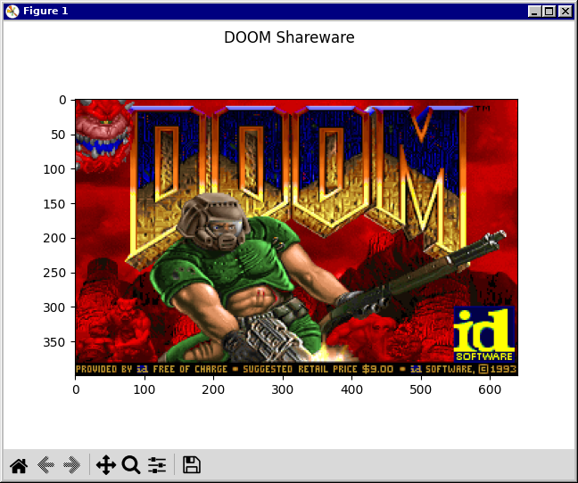
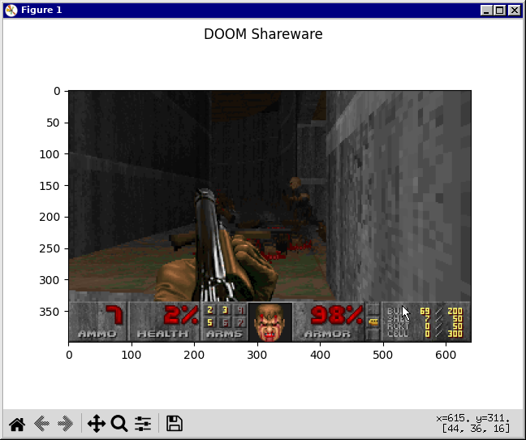

# cyDoomGeneric

Write doom ports in python!

Python bindings for [doomgeneric](https://github.com/ozkl/doomgeneric) with ease-of-use at heart.

To try it you will need a WAD file (game data). If you don't own the game, shareware version is freely available.

NOTE: This project is in early development and a lot of improvements will be made over the coming weeks. The entire build system is super janky, so that'll be a top priority. See the TODO section for some potential problems.

## Porting

You must implement the `draw_frame` and `get_key` functions.

```
import cydoomgeneric as cdg

resx = 640
resy = 400

# Required functions
def draw_frame(pixels: np.ndarray) -> None:
def get_key() -> Optional[Tuple[int, int]]:

# Optional functions
def init() -> None:
def sleep_ms(ms: int) -> None:
def set_window_title(t: str) -> None:
def get_ticks_ms() -> int:

cdg.init(resx,
    resy,
    draw_frame,
    get_key,
    init=init,
    sleep_ms=sleep_ms,
    get_ticks_ms=get_ticks_ms,
    set_window_title=set_window_title)
cdg.main()  # Optional parameter argv=[...]
```

All possible input keys for `get_key` are either members of the `Keys` enum, or the ascii value of the uppercase character `ord(c.upper())`.

Some additional documentation can be found in `cydoomgeneric/cydoomgeneric.pyx`.

## Building

Currently the project only runs on Linux (and potentially osx).

You will need a C compiler (default: gcc) and GNU Make.

The following python packages are required: `numpy cython`. To run the demo, `matplotlib` is also required.

Currently, all python code must be run from the `cydoomgeneric` directory.

```
$ cd doomgeneric
$ make
$ cd ../cydoomgeneric
$ python setup.py build_ext --inplace
```

Then to run the demo:

```
$ cd cydoomgeneric
$ python demo.py
```

## Pyplot Demo Screenshots





## TODO

- Windows build
- Fix segfault when closing game
- Implement sound
